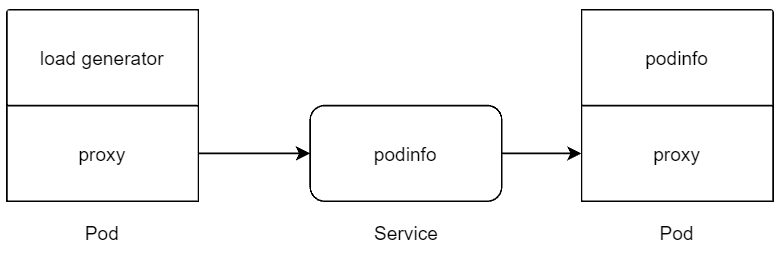

### Первое задание | Ответить на случайные 3 вопроса по каждоый ссылке

1. https://github.com/bregman-arie/devops-exercises/blob/master/topics/kubernetes/CKA.md
2. https://github.com/bregman-arie/devops-exercises/blob/master/topics/kubernetes/README.md#kubernetes-questions
3. https://github.com/eabykov/eabykov/blob/main/ВОПРОСЫ_НА_СОБЕСЕДОВАНИИ.md

### Второе Задание | Реальный пример ресурсов

Рассказать какие ресурсы будут созданы в кластере (сколько pod, в каком namespace) если выполнить команду `kubectl apply -f ./my-manifest.yaml` с содержимым файла `my-manifest.yaml`:

```yaml
apiVersion: v1
kind: Namespace
metadata:
  labels:
    k8s-app: flannel
    pod-security.kubernetes.io/enforce: privileged
  name: kube-flannel
---
apiVersion: v1
kind: ServiceAccount
metadata:
  labels:
    k8s-app: flannel
  name: flannel
  namespace: kube-flannel
---
apiVersion: rbac.authorization.k8s.io/v1
kind: ClusterRole
metadata:
  labels:
    k8s-app: flannel
  name: flannel
rules:
- apiGroups:
  - ""
  resources:
  - pods
  verbs:
  - get
- apiGroups:
  - ""
  resources:
  - nodes
  verbs:
  - get
  - list
  - watch
- apiGroups:
  - ""
  resources:
  - nodes/status
  verbs:
  - patch
- apiGroups:
  - networking.k8s.io
  resources:
  - clustercidrs
  verbs:
  - list
  - watch
---
apiVersion: rbac.authorization.k8s.io/v1
kind: ClusterRoleBinding
metadata:
  labels:
    k8s-app: flannel
  name: flannel
roleRef:
  apiGroup: rbac.authorization.k8s.io
  kind: ClusterRole
  name: flannel
subjects:
- kind: ServiceAccount
  name: flannel
  namespace: kube-flannel
---
apiVersion: v1
kind: ConfigMap
metadata:
  labels:
    app: flannel
    k8s-app: flannel
    tier: node
  name: kube-flannel-cfg
  namespace: kube-flannel
data:
  cni-conf.json: |
    {
      "name": "cbr0",
      "cniVersion": "0.3.1",
      "plugins": [
        {
          "type": "flannel",
          "delegate": {
            "hairpinMode": true,
            "isDefaultGateway": true
          }
        },
        {
          "type": "portmap",
          "capabilities": {
            "portMappings": true
          }
        }
      ]
    }
  net-conf.json: |
    {
      "Network": "10.244.0.0/16",
      "Backend": {
        "Type": "vxlan"
      }
    }
---
apiVersion: apps/v1
kind: DaemonSet
metadata:
  labels:
    app: flannel
    k8s-app: flannel
    tier: node
  name: kube-flannel-ds
  namespace: kube-flannel
spec:
  selector:
    matchLabels:
      app: flannel
      k8s-app: flannel
  template:
    metadata:
      labels:
        app: flannel
        k8s-app: flannel
        tier: node
    spec:
      affinity:
        nodeAffinity:
          requiredDuringSchedulingIgnoredDuringExecution:
            nodeSelectorTerms:
            - matchExpressions:
              - key: kubernetes.io/os
                operator: In
                values:
                - linux
      containers:
      - args:
        - --ip-masq
        - --kube-subnet-mgr
        command:
        - /opt/bin/flanneld
        env:
        - name: POD_NAME
          valueFrom:
            fieldRef:
              fieldPath: metadata.name
        - name: POD_NAMESPACE
          valueFrom:
            fieldRef:
              fieldPath: metadata.namespace
        - name: EVENT_QUEUE_DEPTH
          value: "5000"
        image: docker.io/flannel/flannel:v0.22.1
        name: kube-flannel
        resources:
          requests:
            cpu: 100m
            memory: 50Mi
        securityContext:
          capabilities:
            add:
            - NET_ADMIN
            - NET_RAW
          privileged: false
        volumeMounts:
        - mountPath: /run/flannel
          name: run
        - mountPath: /etc/kube-flannel/
          name: flannel-cfg
        - mountPath: /run/xtables.lock
          name: xtables-lock
      hostNetwork: true
      initContainers:
      - args:
        - -f
        - /flannel
        - /opt/cni/bin/flannel
        command:
        - cp
        image: docker.io/flannel/flannel-cni-plugin:v1.2.0
        name: install-cni-plugin
        volumeMounts:
        - mountPath: /opt/cni/bin
          name: cni-plugin
      - args:
        - -f
        - /etc/kube-flannel/cni-conf.json
        - /etc/cni/net.d/10-flannel.conflist
        command:
        - cp
        image: docker.io/flannel/flannel:v0.22.1
        name: install-cni
        volumeMounts:
        - mountPath: /etc/cni/net.d
          name: cni
        - mountPath: /etc/kube-flannel/
          name: flannel-cfg
      priorityClassName: system-node-critical
      serviceAccountName: flannel
      tolerations:
      - effect: NoSchedule
        operator: Exists
      volumes:
      - hostPath:
          path: /run/flannel
        name: run
      - hostPath:
          path: /opt/cni/bin
        name: cni-plugin
      - hostPath:
          path: /etc/cni/net.d
        name: cni
      - configMap:
          name: kube-flannel-cfg
        name: flannel-cfg
      - hostPath:
          path: /run/xtables.lock
          type: FileOrCreate
        name: xtables-lock
```

> Другие примеры ресурсов на главной странице: [README.md](README.md)

### Деплой локального k8s кластера для выполнения последующих заданий

1. Запустите k8s кластер `curl -sfL https://get.k3s.io | sh -`
2. Посмотреть какие ресурсы есть в кластере командой ниже (дождаться когда все они будут готовы)
   ```sh
   watch sudo k3s kubectl get all --all-namespaces
   ```
   > Вспомнить что делает команда `watch`
4. Веб интерфейс к кластеру используя `dashboard`:
   1. Установить используя комманду:
      ```sh
      sudo k3s kubectl create -f https://raw.githubusercontent.com/kubernetes/dashboard/v2.7.0/aio/deploy/recommended.yaml
      ```
   2. Создать файл `dashboard-access.yml`:
      ```yaml
      ---
      apiVersion: v1
      kind: ServiceAccount
      metadata:
        name: admin-user
        namespace: kubernetes-dashboard
      ---
      apiVersion: rbac.authorization.k8s.io/v1
      kind: ClusterRoleBinding
      metadata:
        name: admin-user
      roleRef:
        apiGroup: rbac.authorization.k8s.io
        kind: ClusterRole
        name: cluster-admin
      subjects:
      - kind: ServiceAccount
        name: admin-user
        namespace: kubernetes-dashboard
      ```
      Применить коммандой:
      ```sh
      sudo k3s kubectl create -f dashboard-access.yml
      ```
   3. Создайте токен для доступа к `dashboard` коммандой:
      ```sh
      sudo k3s kubectl -n kubernetes-dashboard create token admin-user
      ```
   4. Получите доступ к `dashboard` с помощью прокси в кластере:
      ```sh
      sudo k3s kubectl proxy
      ```
   5. `dashboard` доступен по ссылке http://localhost:8001/api/v1/namespaces/kubernetes-dashboard/services/https:kubernetes-dashboard:/proxy/ используйте токен который сгенерировали в пункте 3

### Третье задание | Мониторинг k8s кластера

1. Задеплоить `Deployment` с Grafana
2. Задеплоить `DaemonSet` с node_exporter
3. Задеплоить `StatfulSet` с Prometheus
4. Настроить Prometheus так чтобы он собирал метрики с node_exporter
5. В Grafana подключить Prometheus как Datasource по имени `Service`
6. В Grafana добавить dashboard для node_exporter (найти готовый dashboard в интернете)
7. В Grafana настроить alert с правилом: `Если использование RAM больше 10% отправлять оповещение`

### Четвертое Задание | Простой способ установки и обновлений приложений в k8s

Helm (штурвал) - ПО, которое управляет установкой, обновлением и настройкой контейнеризованных приложений в Kubernetes с помощью сгруппированных пакетов Helm Charts

Пакеты Helm Charts (схемы, чарты), состоят из файлов и шаблонов YAML, которые при развертывании (deployment) преобразуются в файлы манифестов Kubernetes. Чарты нужны чтобы было легко обьединить в одну группу все ресурсы Kubernetes, таких как Deployment, Service, Configmap и прочие, необходимых для работы приложения, затем версионировать (обновлять), публиковать (как один файл) и делиться ими.

При развертывании приложения с помощью Helm Chart вы должны только передать значения для переменных, определенных в шаблоне.

Видеоурок по helm: https://youtu.be/-lLT0vlaBpk

1. Установить `kube-prometheus-stack` через helm (не устанавливаем helm, а используем `HelmChart` ресурс: https://docs.k3s.io/helm#using-the-helm-controller) в кластер https://github.com/prometheus-community/helm-charts/tree/main/charts/kube-prometheus-stack
   1. Посмотреть через `dashboard` какие ресурсы и в каком namespace создались
   2. Разобраться из каких основных файлов состоит чарт (повторить из видео выше)
2. Посмотреть какие есть встроенные переменные в helm: https://github.com/helm/helm-www/blob/main/content/en/docs/chart_template_guide/builtin_objects.md
   - Например проверить есть ли api `autoscaling/v2` для ресурса `HorizontalPodAutoscaler`:
      ```yaml
      {{- if $.Capabilities.APIVersions.Has "autoscaling/v2" }}
      ```

### Пятое задание | Наблюдаемость инфраструктуры k8s

Установить чарт https://github.com/prometheus-community/helm-charts/tree/main/charts/kube-prometheus-stack переопределив переменные:
```yaml
prometheusOperator:
  admissionWebhooks:
    patch:
      image:
        registry: docker.io
        repository: dyrnq/kube-webhook-certgen
        tag: v20221220-controller-v1.5.1-58-g787ea74b6
   
kube-state-metrics:
  image:
    registry: docker.io
    repository: bitnami/kube-state-metrics
    tag: 2.10.1
```

### Пятое задание | Наблюдаемость и управление сетью в k8s с помощью service mesh

Service mesh — инструмент, позволяющий контролировать и наблюдать, как разные наборы pod обмениваются данными между собой. В отличие от других систем управления, он представляет собой отдельный слой инфраструктуры, это proxy который встраивается прямо в pod и работает рядом с приложением.

Service mesh позволяет:
- наблюдать за трафиком между приложениями (замерять например количество ошибок или время ответа)
   - предоставляет метрики (по которым можно отслеживать золотые сигналы)
   - записывает лог всех запросов (в них подробная информация, например время ответа или GET или POST был запрос)
- настраивать правила балансировки, например [LEAST_REQUEST](https://istio.io/latest/docs/reference/config/networking/destination-rule/#LoadBalancerSettings-SimpleLB) который отправляет запросы на конечные точки на которых меньше всего сейчас обрабатывается запросов (послано уже запросов) 
- шифровать трафик между приложенями для безопасности с помощью mTLS: https://istio.io/latest/docs/ops/configuration/traffic-management/tls-configuration/ 
- повторно выполняет запрос если произошла ошибка или задает таймаут для запросов
- позволяет выполнять канареечный релиз https://docs.flagger.app/tutorials/istio-progressive-delivery (постепенно переключать трафик на новую версию и если не появилось больше ошибок и время ответа такое же примерно то переключит весь трафик) 
- автоматически добавляет proxy к вашим pod (нужно только [добавить lable к namespace](https://istio.io/latest/docs/setup/additional-setup/sidecar-injection/) и service mesh сам добавить proxy ко всем pod которые будут созданы в namespace)

C service mesh запрос от одного приложения к другому выглядит так:



Выполнить задание на основе linkerd: https://istio.io/latest/docs/setup/getting-started/
